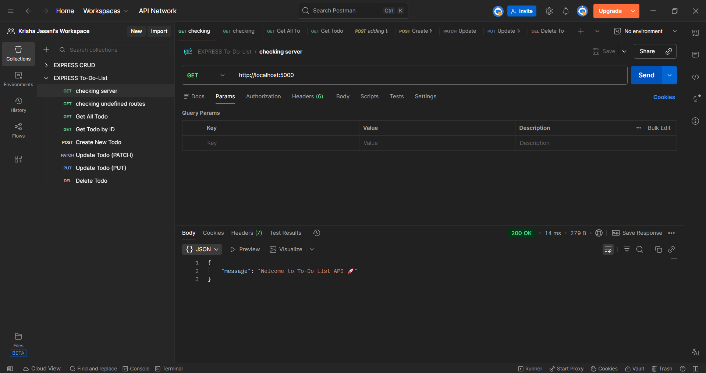
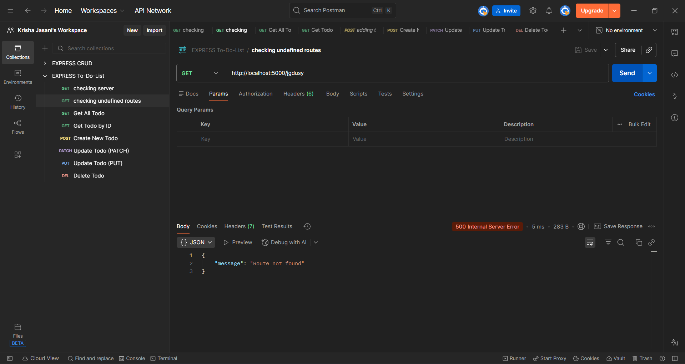
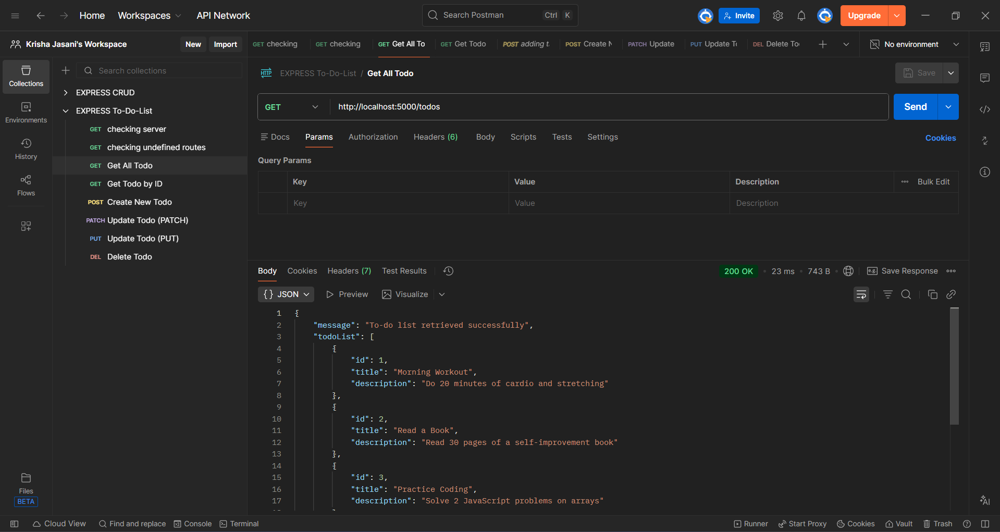
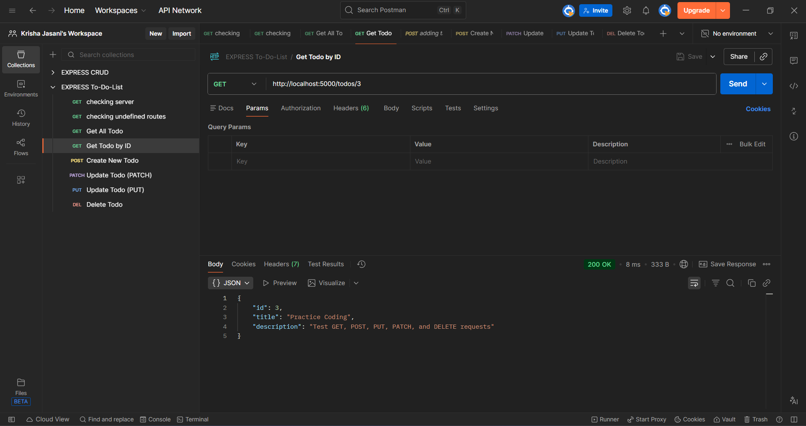
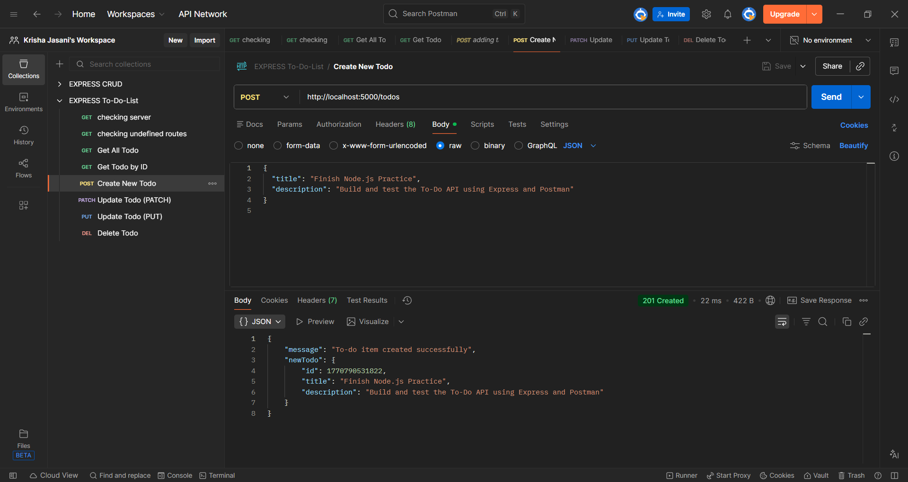
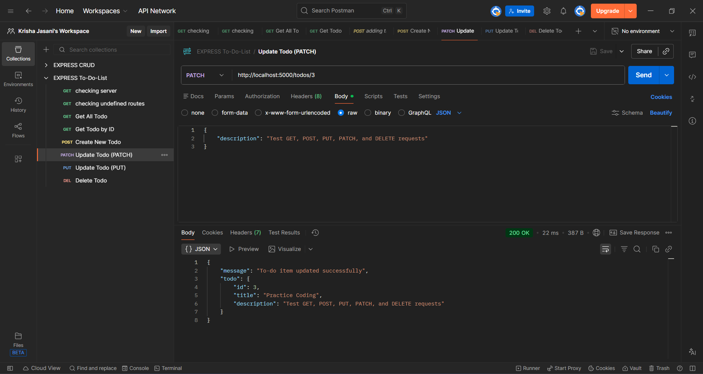
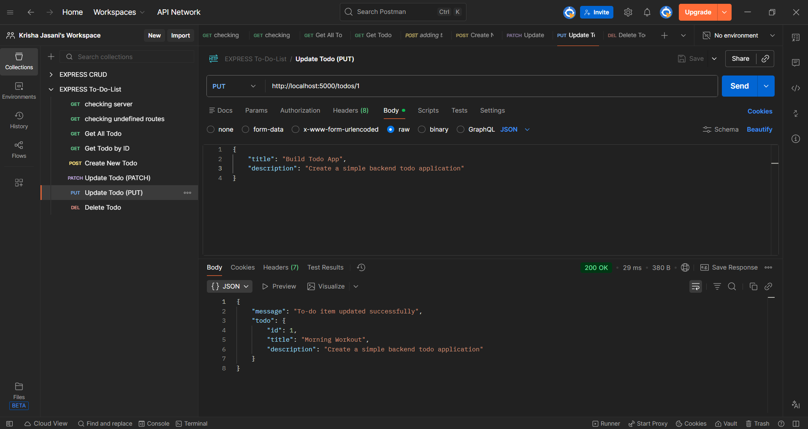
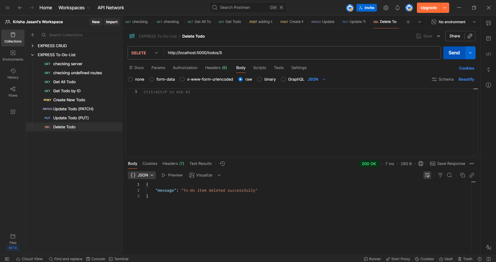

# ✅ To-Do List API (Node.js + Express)

A simple and beginner-friendly **RESTful To-Do List API** built using **Node.js** and **Express.js**.  
This project demonstrates **CRUD operations** and **centralized error handling** using a custom `HttpError` class.

---

## 🚀 Features

- 🏠 Home route with welcome message  
- 📋 Get all to-do items  
- 🔍 Get a single to-do by ID  
- ➕ Create a new to-do  
- ✏️ Update a to-do (PATCH)  
- 🔁 Replace a to-do (PUT)  
- ❌ Delete a to-do  
- ⚠️ Centralized custom error handling  
- 🧠 Clean, readable, beginner-friendly code  

---

## 🛠️ Tech Stack

- **Runtime:** Node.js  
- **Framework:** Express.js  
- **API Style:** REST  
- **Data Storage:** In-memory array (for learning)  
- **Testing Tools:** Postman / Thunder Client  

---

## 📁 Project Structure

todo-api/
│
├── middleware/
│ └── httpError.js
│
├── app.js
├── package.json
└── README.md


---

## 📌 API Endpoints

### 🏠 Home

GET /

### 📋 Get All Todos

GET /todos

### 🔍 Get Todo by ID

GET /todos/:id

### ➕ Create Todo


### ➕ Create Todo
POST /todos


**Body (JSON):**
```json
{
  "title": "Learn Express",
  "description": "Understand routing and middleware"
}


✏️ Update Todo (PATCH)

PATCH /todos/:id

Body (JSON):
{
  "title": "Updated title",
  "description": "Updated description"
}

🔁 Replace Todo (PUT)

PUT /todos/:id

Body (JSON):
{
  "title": "New title",
  "description": "New description"
}

❌ Delete Todo

DELETE /todos/:id


🧪 API Testing (Postman)
📸 Screenshots

Home Route
<br><br>

Undefined Route Handling
<br><br>

Get All Todos
<br><br>

Get Todo by ID
<br><br>

Create Todo
<br><br>

Update Todo (PATCH)
<br><br>

Update Todo (PUT)
<br><br>

Delete Todo



⚙️ Installation & Run
1️⃣ Clone the repository
git clone https://github.com/your-username/todo-api.git

2️⃣ Go to the project folder
cd todo-api

3️⃣ Install dependencies
npm install

4️⃣ Start the server
npm run dev

5️⃣ Server will run at
http://localhost:5000

